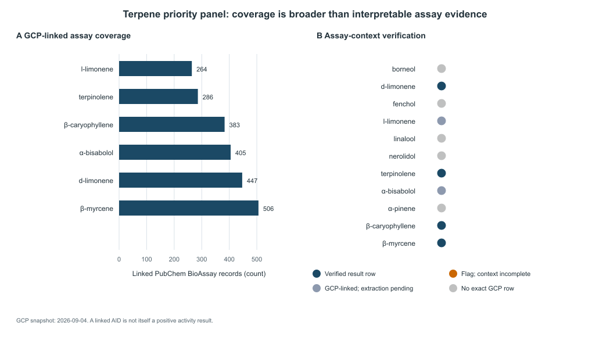

# Terpene Bioassay Activity: An Evidence-Bounded Review of Experimental Signals

**Article type:** Scoping review / systematic evidence map  
**Status:** Protocol and manuscript scaffold; initial GCP coverage results recorded 2026-09-04  
**Target journal:** *Phytochemistry Reviews* (Springer Nature)

**Working title:** *What Does “Active” Mean for a Terpene? An Identity-Resolved
Evidence Map of Terpene Bioassay Activity*

**Keywords:** terpenes; phytochemistry; bioassay; natural products;
structure–activity relationships; evidence synthesis

## Abstract

### Background

Terpenes are frequently described using broad activity labels that combine
biochemical assays, cellular phenotypes, animal studies, database annotations,
and traditional or commercial claims. These evidence types answer different
questions and are not interchangeable.

### Objective

To map experimental bioassay activity reported for identity-resolved terpenes,
characterize the assay systems and endpoints involved, and assess how strongly
the available data support compound–target or compound–phenotype claims.

### Methods

We will conduct a structured scoping review of PubChem BioAssay, ChEMBL,
PubMed, and the Terpedia source inventory, recording chemical identity,
stereochemistry, assay context, endpoint, concentration range, controls,
replication, provenance, and limitations. Evidence will be tiered from direct
identity-resolved assay data to hypothesis-only predictions. Comparable
quantitative results will be summarized without combining incompatible assay
formats or endpoints.

### Results

*To be completed after the search, screening, and extraction passes.*

### Conclusions

*To be completed.* The review will distinguish measured assay activity from
mechanistic, physiological, and clinical interpretations.

## 1. Introduction

Terpenes occur across plants, foods, essential oils, and formulated products,
and their literature is distributed across pharmacology, natural-products
chemistry, toxicology, sensory biology, and database resources. The same
compound may therefore appear as a ligand, an antimicrobial, a cytotoxic
agent, a volatile constituent, or a predicted bioactive molecule without the
underlying evidence being equivalent.

The central problem addressed here is not whether terpenes can produce assay
signals. It is whether those signals are identity-resolved, experimentally
reproducible, appropriately normalized, and interpretable within the assay
system in which they were measured.

## 2. Methods

The prespecified protocol is [`../protocol.md`](../protocol.md). The review
will follow a transparent search, screening, extraction, and evidence-audit
workflow. Search dates, queries, source versions, exclusion reasons, and
extraction changes will be recorded in `data/` and `notes/`.

### 2.1 Evidence domains

We will organize records into biochemical binding, enzymatic activity,
receptor/channel function, cellular phenotypes, antimicrobial activity,
cytotoxicity, toxicity, and organism-level outcomes. Predictions and
annotations will remain separate from measured assays.

### 2.2 Chemical identity

Names alone will not be treated as sufficient identity. Where available, the
review will retain InChIKey, canonical/isomeric SMILES, PubChem CID, ChEBI ID,
stereochemical designation, and tested form or formulation. Racemate,
enantiopure compound, oxidized product, and mixture records will not be
collapsed without an explicit justification.

### 2.3 Quantitative synthesis

Results will be summarized by assay and endpoint. IC50, EC50, Ki, MIC, percent
inhibition, percent activation, and viability measures will remain distinct.
Values will not be converted or ranked across incompatible systems merely to
create a single activity score.

## 3. Results

### 3.1 Search and screening

The Terpedia GCP snapshot contains 226,050 PubChem CID assay-lookup rows.
Of these, 29,254 rows have one or more linked PubChem BioAssay records and
196,796 have a zero assay count. In a separate identity-to-CID join, 48,708
Terpedia IDs connect to at least one PubChem CID and 6,454 have at least one
joined CID with a nonzero assay count. These are coverage results, not counts
of active terpenes or positive assays.

### 3.2 Compound and assay coverage

The coverage snapshot supports an evidence-map claim that many Terpedia
chemical identities have linked assay records, while most joined IDs have no
linked assay in this snapshot. The lookup table contains CID-level assay
counts and AID lists, but not the assay endpoint, direction, potency, control
quality, or result interpretation needed to promote a record to measured
terpene activity. In the initial priority panel, exact GCP rows were present
for β-caryophyllene (383 linked records), β-myrcene (506), α-bisabolol (405),
d-limonene (447), l-limonene (264), and terpinolene (286); exact rows were not
present for nerolidol, linalool, racemic α-pinene, borneol, or fenchol. This is
a snapshot coverage result, not a biological negative.

Underlying assay records were verified end-to-end for two compounds in AID
332912: β-caryophyllene (MIC 6.25 μg/mL) and terpinolene (MIC 50 μg/mL) against
*Cutibacterium acnes* ATCC 11827, with PMID 8158169 and DOI
10.1021/np50103a002. A separate ChEMBL-derived assay (AID 338300) reports
β-myrcene at 6.7% activity in an inhalation assay against *Psoroptes ovis*.
In the same assay series, β-myrcene was reported at 0%, 5.2%, and 6.7% at 1,
3, and 6 μL, respectively, whereas d-limonene was reported at 0% in three
direct-contact dilutions. These are endpoint- and organism-specific
observations; MIC, percent activity,
and receptor potency must not be pooled or presented as a universal terpene
activity ranking.

The priority panel also demonstrates why assay flags require context:
d-limonene is marked “Active” in AID 1189, but the returned record lacks a
quantitative endpoint and belongs to a Salmonella mutagenicity summary. It is
therefore retained as a context-limited record rather than promoted to a
general activity claim.

#### Table 1. Verified assay-level observations in the initial priority panel

| Compound | PubChem CID | AID | Assay system | Endpoint | Result | Evidence boundary |
|---|---:|---:|---|---|---:|---|
| β-caryophyllene | 5281515 | 332912 | *C. acnes* ATCC 11827 | MIC | 6.25 μg/mL | Endpoint- and organism-specific observation |
| Terpinolene | 11463 | 332912 | *C. acnes* ATCC 11827 | MIC | 50 μg/mL | Endpoint- and organism-specific observation |
| β-myrcene | 31253 | 338300 | *Psoroptes ovis* | Activity | 6.7% | Not comparable with MIC or receptor potency |
| d-Limonene | 440917 | 1189 | Salmonella mutagenicity summary | Activity flag | Active | No quantitative endpoint; context-limited |

The complete machine-readable observations, including SIDs, source accessions,
PMIDs, DOIs, and interpretation boundaries, are in
[`../data/priority-assay-observations.csv`](../data/priority-assay-observations.csv).

**Figure 1.** GCP-linked assay coverage is shown separately from assay-context
verification. A nonzero linked-record count does not mean that the compound was
active, and an absent exact row is not evidence of inactivity.

Planned outputs include a PRISMA-style flow summary, a
compound identity table, an assay-level evidence map, and a missing-context
table.

### 3.3 Activity patterns by evidence domain

*Pending extraction.*

## 4. Discussion

The discussion will address assay comparability, stereochemical identity,
concentration relevance, control quality, mixture effects, cytotoxicity as a
confounder, publication and database coverage, and the gap between in-vitro
activity and organism-level relevance.

The review will not treat a missing database join as biological inactivity, a
target annotation as proof of binding, or an in-vitro effect as clinical
efficacy. These boundaries are part of the result, not a limitation to be
removed from the interpretation.

## 5. Conclusions

*Pending evidence synthesis.* The final conclusion should state what is
directly supported, what remains conditional, and which experiments would most
efficiently resolve the major uncertainties.

## Declarations

**Funding:** To be completed.  
**Conflicts of interest:** To be completed.  
**Author contributions:** To be completed using CRediT roles.  
**Ethics approval and consent:** Not applicable; this is a literature and
database review with no new human or animal intervention.  
**Data availability:** Extracted records, search logs, and analysis scripts
will be versioned in this repository when the review pass is complete.

## References

*To be generated from the frozen evidence table. Do not populate this section
with unverified citations.*
